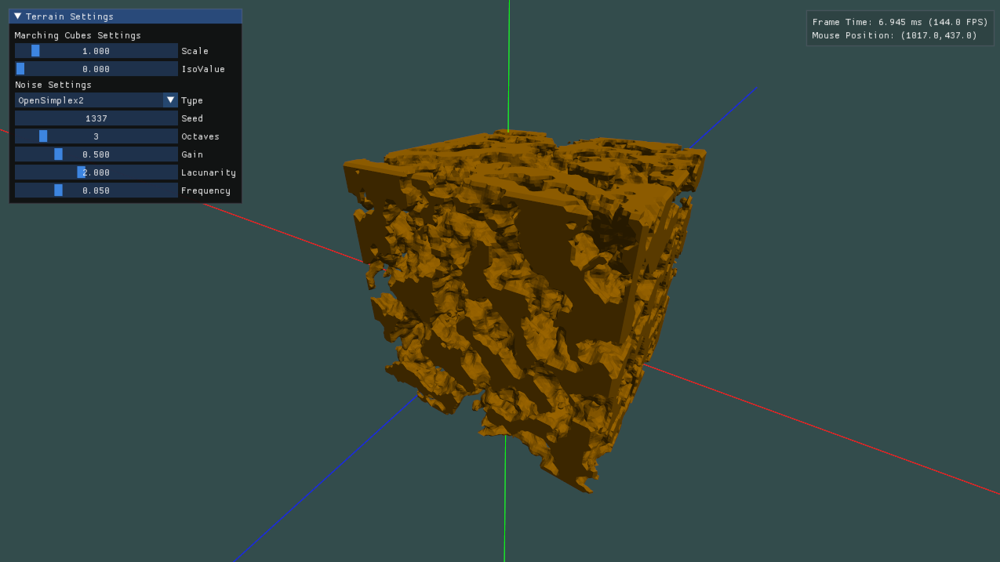

# MarchingCompute

A compute shader implementation of marching cubes.

## About

This is a simple demo of my compute shader implementation of the marching cubes algorithm. The underlying methods are based on the article from [Paul Bourke] and the compute shader code is based on Sebastian Lague's marching cubes [implementation] in unity. 

The voxel generation can be altered at runtime by a few parameters. These include a scale, isoValue and noise settings. The distance function samples from 3D noise, based on the current isoValue. Various noise settings are included in order to customize the voxel generation.

## Launch

This project requires an OpenGL version of 4.3 or higher, as it makes use of the compute shader and shader storage buffer features. It also requires a modern version of CMake to build (3.17+, don't forget to clone recursively).
When running the project, make sure to set the working directory to the `res` folder, it won't find the required shaders otherwise.

## Libraries

- [FastNoise Lite]
- [Glad]
- [GLFW]
- [GLM]
- [Dear ImGui]

[Paul Bourke]: <http://paulbourke.net/geometry/polygonise/>
[implementation]: <https://github.com/SebLague/Marching-Cubes>

[FastNoise Lite]: <https://github.com/Auburn/FastNoiseLite>
[Glad]: <https://glad.dav1d.de>
[GLFW]: <https://github.com/glfw/glfw>
[GLM]: <https://github.com/g-truc/glm>
[Dear ImGui]: <https://github.com/ocornut/imgui>
